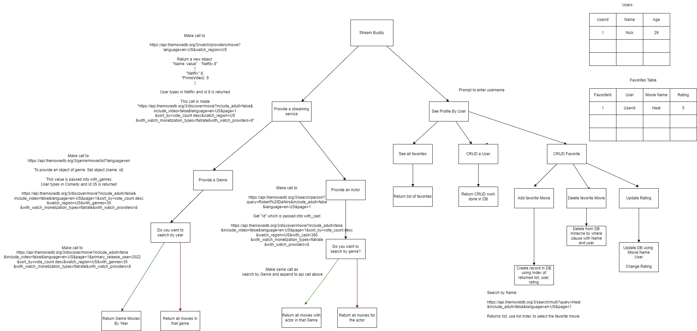

# Stream-buddy

### Description
Stop the scrolling, use Stream Buddy, a Python application that searches The Movie Database to provide a suggested movie based on your preferences.

### Relationships, Constraints, and CRUD Actions
[Include information about the relationships, constraints, and CRUD actions of your app here.]

### User Stories

### Kanban Board
https://trello.com/b/2JTT5q2M/stream-buddy